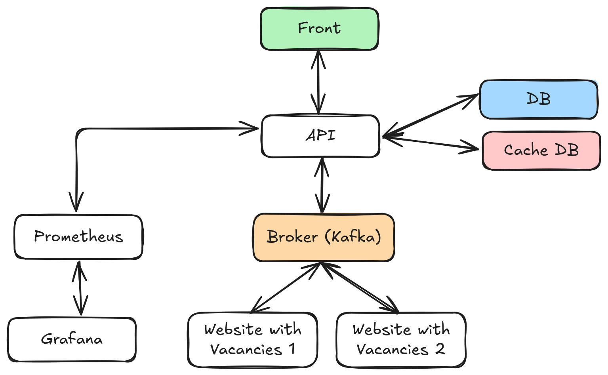

# VacancyParser

## ✒️ Description

For automatic parsing and filtering of job vacancies from multiple company websites and platforms, with the ability to select your preferred sources.

## 🗃️ Architecture




**Tech Stack:**
- Python 3.11+
- PostgreSQL
- Redis
- Fast API

## 🚀 Quick Start

### Local Development (Recommended)

> uvicorn main:app --reload

### Run migrations

#### 1. Prerequisites

- Python 3.11+
- PostgreSQL
- Redis

#### 2. Install Dependencies

```bash
# Install uv, create virtual environment, and setup pre-commit hooks
make setup

# Install project dependencies
make install
```

#### 3. Configure Environment Variables

Create `.env` file:

```bash
cp .env.example .env
```

Fill in the values:

```bash
# PostgreSQL
DB_HOST=localhost
DB_PORT=5432
DB_USER=vacancy_parser
DB_PASSWORD=vacancy_parser
DB_NAME=vacancy_parser

# Application
JWT_SECRET_KEY=Some_Secret_Key
LOG_LEVEL=INFO
```

#### 4. Apply Database Migrations

```bash
>>> make db-upgrade
```

#### 5. Run API

**In first terminal (WhatsApp API):**
```bash
make run-api
```

#### 6. Test API

- **API:** Open http://0.0.0.0:8000/api/ to view API


### Docker

#### 1. Prerequisites

- Docker

#### 2. Configure Environment Variables

Create `.env` file:

```bash
cp .env.example .env
```

Fill in the values:

```bash
# PostgreSQL 
DB_HOST=localhost
DB_PORT=5432
DB_USER=vacancy_parser
DB_PASSWORD=vacancy_parser
DB_NAME=vacancy_parser

# Application
JWT_SECRET_KEY=Some_Secret_Key
LOG_LEVEL=INFO
```

#### 3. Run
```bash
# Start all services
make compose-up

# View logs
make compose-logs

# Stop services
make compose-down
```

#### 4. Test API

- **API:** Open http://0.0.0.0:8000/api/ to view API


## 📂 Project Structure

```
vacancy-parser/
├── alembic/                  # Database
│   ├── versions/             # Migrations
│   ├── env.py
│   └── script.py.mako
├── docs/                     # Documentation
│   └── architecture-api.md   
├── infrastructure/           # Docker Compose, Render config
│   └── docker-compose.yml
├── src/
│   ├── api/                  # API
│   │   ├── exceptions/       # Exceptions
│   │   ├── routes/           # Routes
│   │   ├── schemas/          # Schemas
│   │   ├── services/         # Services
│   │   ├── utils/            # Utils
│   │   └── main.py
│   ├── core/                 # Main 
│   │   ├── configs/          # Settings
│   │   ├── db/               # Database
│   │   ├── repositories/     # Repositories
│   │   ├── schemas/          # Schemas
│   │   ├── services/         # Services
│   │   └── utils/            # Utils
│   └── parser/               # Parser
│       ├── services/         # Services
│       ├── utils/            # Utils
│       └── main.py
├── tests/
│   └── main.py 
├── .pre-commit-config.yaml   # CI/CD pipeline
├── alembic.ini
├── Dockerfile
├── makefile
├── README.md
├── requirements.txt
└── requirements-dev.txt
```

## 🛠️ Available Commands

All commands are executed via `make`:

### Environment Management
- `make setup` — install uv, create virtual environment and activate pre-commit hooks
- `make install` — install dependencies from pyproject.toml
- `make clean` — remove temporary files

### Database
- `make db-init` — initialize alembic
- `make db-migrate` — create new migration based on models
- `make db-upgrade` — apply all migrations to the database
- `make db-downgrade` — rollback last migration

### Code Quality
- `make format` — format code and auto-fix linting issues (ruff)
- `make lint` — check code quality without auto-fixing (for CI)
- `make mypy` — type checking

### Local Run
- `make run-api` — run API

### Docker Compose
- `make compose-up` — start all services in Docker
- `make compose-down` — stop Docker containers
- `make compose-logs` — show logs of all services
- `make compose-build` — rebuild Docker images


## 🔧 Configuration

### Environment Variables

#### Required Variables

| Variable      | Description         | Example (Local)   | Example (Prod) |
|---------------|---------------------|-------------------|----------------|
| `DB_HOST`     | Database host       | `localhost`       | `...`          |
| `DB_PORT`     | Database port       | `5432`            | `...`          |
| `DB_USER`     | Database user       | `vacancy_parser`  | `...`          |
| `DB_PASSWORD` | Database password   | `vacancy_parser`  | `...`          |
| `DB_NAME`     | Database name       | `vacancy_parser`  | `...`          |

#### Optional Variables (with defaults)

| Variable          | Description             | Default Value |
|-------------------|-------------------------|---------------|
| `JWT_SECRET_KEY`  | JWT secret key          | `Some Key`    |
| `LOG_LEVEL`       | Logging level           | `INFO`        |

[//]: # (## 📚 Documentation)

[//]: # (## 📊 Monitoring)

## 🐛 Issues and Support

If you encounter problems:
1. Check logs: open local terminal with logs or `make compose-logs`
2. Check environment variables in `.env`
3. Create issue in GitHub
