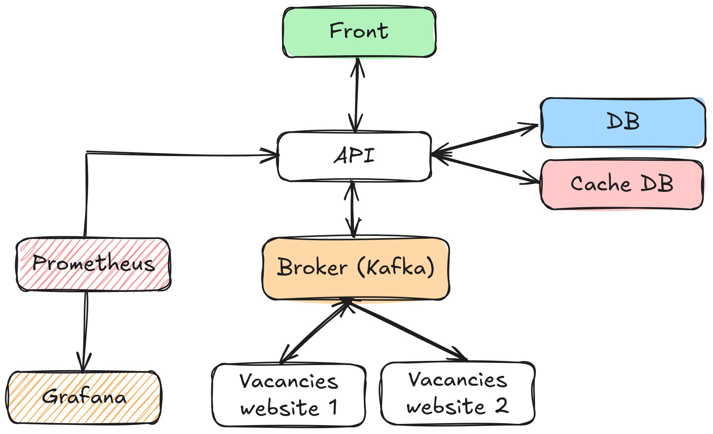
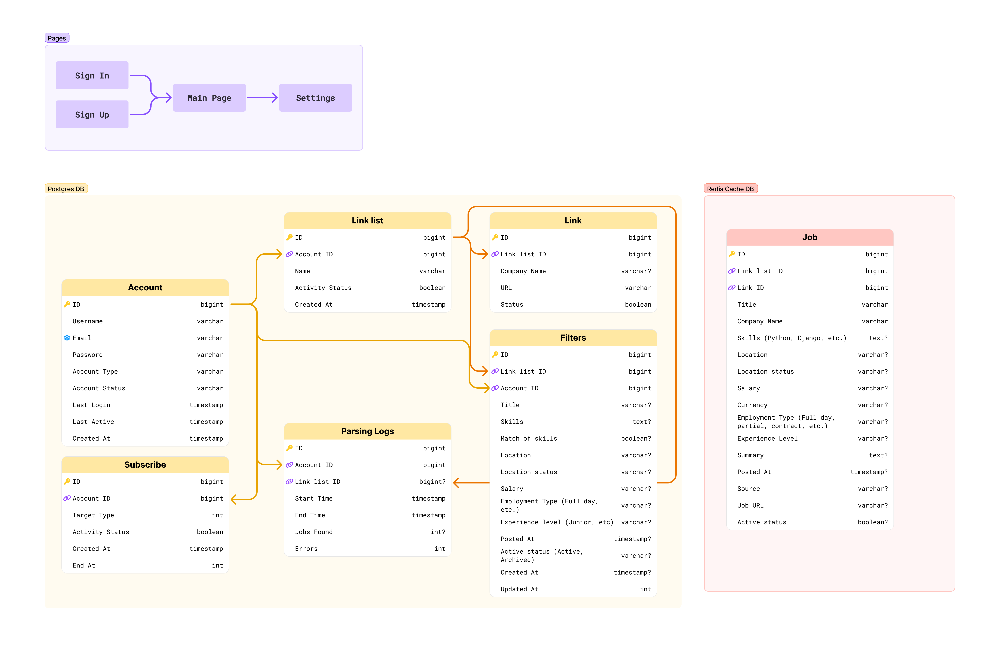
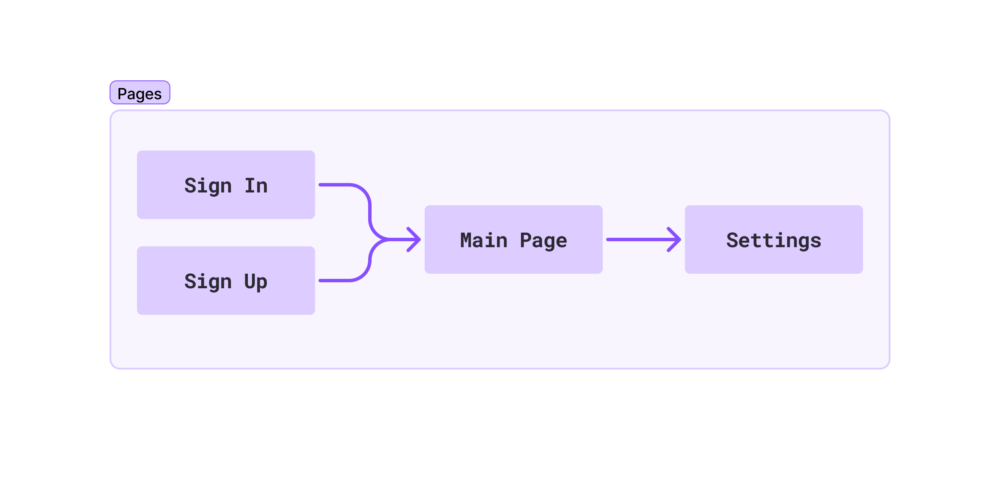

# VacancyParser

### _This project is intended for educational purposes. The author is not responsible for its use on sites that prohibit parsing. It is the user's responsibility to respect the ToS of the target sites. The project does not encourage scraping of sites that prohibit it. Use at your own risk and responsibility._

## ✒️ Description

For automatic parsing and filtering of job vacancies from multiple company websites and platforms, with the ability to select your preferred sources.

## 🗃️ Architecture







## 📋 Endpoints

## 🔐 Authentication Endpoints

### Signing in to your account and generate access and refresh tokens

___

#### Request

`POST /api/auth/sign-in/`

```json
{
  "email": "johndoe@example.com",
  "password": "secret"
}
```

#### Response

```json
{
    "access_token": "eyJhbGciOiJIUzI1NiIsInR5cCI6IkpvaG4iOnsic3RhY2siOiJI",
    "refresh_token": "eyJhbGciOiJIUzI1NiIsInR5cCI6IkpvaG4iOnsic3RhY2siOiJI"
}
```

### Signing up to your account and generate access and refresh tokens

___

#### Request

`POST /api/auth/sign-up/`

```json
{
  "username": "johndoe",
  "email": "johndoe@example.com",
  "password": "secret"
}
```

#### Response

```json
{
    "access_token": "eyJhbGciOiJIUzI1NiIsInR5cCI6IkpvaG4iOnsic3RhY2siOiJI",
    "refresh_token": "eyJhbGciOiJIUzI1NiIsInR5cCI6IkpvaG4iOnsic3RhY2siOiJI"
}
```

### Signing out to your account and remove access token

___

#### Request

`POST /api/auth/sign-out/`

#### Response

```json
{
  "message": "Logged out successfully"
}
```

### Showing information about your account

___

#### Request

`GET /api/account/info/`

#### Response

```json
{
    "username": "jhohndoe",
    "email": "jhondoe@example.com"
}
```

### Changing your username

___

#### Request

`PATCH /api/account/settings/username/`

```json
{
  "username": "johndoe2"
}
```

#### Response

```json
{
  "message": "Username updated successfully"
}
```

### Changing your email
___

#### Request

`PATCH /api/account/settings/email/`

```json
{
  "email": "johndoe2@example.com"
}
```

#### Response

```json
{
  "message": "Email updated successfully"
}
```

### Changing your account type

___

#### Request

`PATCH /api/account/info/account-type/`

```json
{
  "type": "ADMIN"
}
```

#### Response

```json
{
  "message": "Account type changed successfully"
}
```

### Show all subscriptions
___

#### Request

`GET /api/account/subscriptions/`

#### Response

```json
{
  "page": 1,
  "total": 1,
  "subscriptions": [
    {
      "id": 1,
      "type": "MONTHLY",
      "status": "ACTIVE",
      "created_at": "2022-01-01T12:00:00Z",
      "end_at": "2022-02-01T12:00:00Z"
    }
  ]
}
```

### Create a new subscription
___

#### Request

`POST /api/account/subscriptions/`

```json
{
  "type": "MONTHLY"
}
```

#### Response

```json
{
  "message": "Subscription created successfully"
}
```

### Update a subscription by id
___

#### Request

`PUT /api/account/subscriptions/:id/update/`

```json
{
    "type": "MONTHLY"
}
```

#### Response

```json
{
    "message": "Subscription updated successfully"
}
```


## 🗂️ Vacancies Endpoints

### Show all link lists

___

#### Request

`GET /api/account/link-lists/`

#### Response

```json
{
    "lists": [
      {
        "id": 1,
        "name": "Link List 1",
        "status": true,
        "created_at": "2022-01-01T12:00:00Z"
      }
    ]
}
```


### Create a new link list
___

#### Request

`POST /api/account/link-lists/`

```json
{
  "name": "Link List 1"
}
```

#### Response

```json
{
    "message": "A new list created successfully"
}
```

### Change a link list name
___

#### Request

`PATCH /api/account/link-lists/:id/update-name/`

```json
{
  "name": "Link List 2"
}
```

#### Response

```json
{
    "message": "List name updated successfully"
}
```

### Change a link list status
___

#### Request

`PATCH /api/account/link-lists/:id/change-status/`

```json
{
  "status": true
}
```

#### Response

```json
{
    "message": "List status updated successfully"
}
```

### Show a filter for a link list 
___

#### Request

`GET /api/account/link-lists/:id/filter/`

#### Response

```json
{
  "title": "Python Developer",
  "location": "New York",
  "skills": ["Python", "Django"],
  "experience": "3-5 years",
  "location_status": "ACTIVE",
  ...
}
```

### Edit or create a link list filter
___

#### Request

`POST /api/account/link-lists/:id/filter/`

```json
{
  "title": true,
  ...
}
```

#### Response

```json
{
    "message": "Filter updated successfully"
}
```

### Show all vacancies in a link list
___

#### Request

`GET /api/account/link-lists/:id/vacancies/`

```json
{
  "name": "Link List 2"
}
```

#### Response

```json
{
  "page": 1,
  "total": 1,
  "vacancies": [
    {
      "id": 1,
      "title": "Senior Software Engineer",
      "company_name": "XYZ Corp.",
      "company_url": "https://example.com/company-1",
      "skills": ["Python", "Django", "JavaScript"],
      "location": "New York, NY",
      "location_status": "REMOTE",
      "salary": "10000",
      "currency": "USD",
      "employment_type": "FULL_TIME",
      "level": "JUNIOR",
      "summary": "Senior software engineer with experience in Python and Java",
      "posted_at": "2022-01-01T12:00:00Z",
      "source": "LINKEDIN",
      "job_url": "https://www.linkedin.com/jobs/view/1234567890",
      "active_status": true
    }
  ]
}
```

### Show all links in a link list
___


#### Request

`GET /api/account/link-lists/:id/links/`


#### Response

```json
{
  "links": [
    {
        "company_name": "Company Name 1",
        "url": "https://example.com/company-1",
        "status": true
    }
  ]
}
```

### Add a new link in a link list
___

#### Request

`POST /api/account/link-lists/:id/links/`

```json
{
  "url": "https://example.com/company-1"
}
```

#### Response

```json 
{
  "message": "Link added successfully"
}
```

### Changing a link 
___

#### Request

` PATCH /api/account/link-lists/:id/links/:id/change-url/ `

```json
{
  "url": "https://example.com/company-2"
}
```

#### Response

```json 
{
  "message": "Link updated successfully"
}
```

### Changing a status of a link 
___

#### Request

`PATCH /api/account/link-lists/:id/links/:id/status/`

```json
{
  "status": true
}
```

#### Response

```json 
{
  "message": "Link added successfully"
}
```

### Show all parsing logs
___

#### Request

`GET /api/account/link-lists/:id/parsing-logs/`

#### Response

```json 
{
  "company_name": "XYZ Corp.",
  "company_url": "https://example.com/company-1",
  "start-time": "2022-01-01T12:00:00Z",
  "end-time": "2022-01-01T12:24:18Z",
  "jobs-found": 17,
  "errors": 1
}
```

### Show one parsing log
___

#### Request

`GET /api/account/link-lists/:id/parsing-logs/:id`

#### Response

```json 
{
  "company_name": "XYZ Corp.",
  "company_url": "https://example.com/company-1",
  "start-time": "2022-01-01T12:00:00Z",
  "end-time": "2022-01-01T12:24:18Z",
  "jobs-found": 17,
  "errors": 1
}
```

## 🏁 How to run

### Run migrations

> alembic upgrade head

### Run application

> uvicorn main:app --reload
