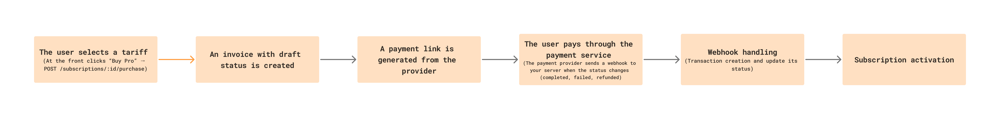

## 💳 Subscribe




## Subscription endpoints

Subscription types:

| Title   | Links/hour  | Add. features                      | Price |
|---------|-------------|------------------------------------|-------|
| Free    | 20          | History 7 days, export to CSV/XLS  | 0$    |
| Pro     | 50          | History 30 days, export to CSV/XLS | 6$    |
| Premium | 100         | History 90 days, export to CSV/XLS | 20$   |
| Custom  | Any         | History XX days, export to CSV/XLS | ?$    |


### Get all available subscriptions

#### Request

`GET /api/subscraptions/`

#### Response

```json
{
  "subscriptions": [
    {
      "id": 1,  
      "name": "Free",
      "links_per_hour": 20,
      "price": 0.0,
      "currency": "USD",
      "description": "Basic rate, up to 20 links/hour",
      "features": ["history_7_days", 
        "export_to_csv", "export_to_xls", "export_to_txt"]
    }
  ]
}
```


### Get detailed information on the subscription

#### Request

`GET /api/subscraptions/{id}/`

#### Response

```json
{
  "id": 1,  
  "name": "Free",
  "links_per_hour": 20,
  "price": 0.0,
  "currency": "USD",
  "description": "Basic rate, up to 20 links/hour",
  "features": [""]
}
```


### Purchasing a subscription / starting the payment process

#### Request

`POST /api/subscraptions/{id}/purchase/`

```json
{
  "subscription_name": "Pro",
  "amount": 6.0,
  "currency": "USD"
}
```

#### Response

```json
{
  "id": 102, 
  "subscription_name": "Pro",
  "amount": 6.0,
  "currency": "USD",
  "status": "pending",            
  "payment_url": "https://payment-provider.com/pay/xyz789",
  "expires_at": "2026-01-31T23:59:59Z",
  "created_at": "2026-01-01T00:00:00Z"
}
```


## Invoice Endpoints

Invoices statuses:

| Name       | Description                                                       | 
|------------|-------------------------------------------------------------------|
| draft      | The invoice has just been created.                                | 
| pending    | Backend added **expires_at** and **payment_link** for the invoice | 
| paid       | The customer paid for the invoice                                 | 
| overdue    | The user did not pay before **expires_at** expired                | 
| canceled   | The customer canceled the invoice                                 |


### Show all user invoices

#### Request

`GET /api/invoices/`

#### Response

```json
{
  "invoices": [
    {
      "id": 102,
      "subscription_name": "Pro",
      "amount": 6.0,
      "currency": "USD",
      "status": "pending",            
      "payment_url": "https://payment-provider.com/pay/xyz789",
      "expires_at": "2026-01-31T23:59:59Z",
      "created_at": "2026-01-01T00:00:00Z"
    }
  ]
}
```


### Show invoice details

#### Request

`GET /api/invoices/{id}/`

#### Response

```json
{
  "id": 101,
  "subscription": {
      "id": 1,  
      "name": "Pro",
      "links_per_hour": 50,
      "price": 6.0,
      "currency": "USD",
      "description": "Pro rate, up to 50 links/hour",
      "features": ["history_30_days", 
        "export_to_csv", "export_to_xls", "export_to_txt"]
  },
  "amount": 6.0,
  "currency": "USD",
  "status": "paid",  
  "payment_url": "https://payment-provider.com/pay/xyz789",
  "expires_at": "2026-01-31T23:59:59Z",
  "created_at": "2026-01-01T00:00:00Z",
  "paid_at": "2025-11-26T10:00:00Z",
  "transactions": {
      "id": 301,
      "amount": 6.0,
      "currency": "USD",
      "status": "pending",       
      "provider": "stripe",
      "provider_tx_id": "txn_abc123",
      "created_at": "2025-12-24T15:05:00Z"
    }
}
```


### Payment attempt (may call Stripe/Yoo provider)

#### Request

`POST /api/invoices/{id}/pay/`

#### Response

```json
{
  "id": 102,
  "amount": 6.0,
  "currency": "USD",
  "status": "pending",            
  "payment_url": "https://payment-provider.com/pay/xyz789",
  "expires_at": "2026-01-31T23:59:59Z",
  "created_at": "2026-01-01T00:00:00Z"
}
```


## Transaction Endpoints

### Find all transactions

#### Request

`GET /api/transactions/`

#### Response

```json
{
  "transactions": [
    {
      "id": 301,
      "invoice_id": 101,
      "subscription_name": "Pro",
      "amount": 9.99,
      "currency": "USD",
      "status": "success",
      "provider": "stripe",
      "provider_tx_id": "txn_abc123",
      "created_at": "2025-12-24T15:05:00Z",
      "paid_at": null
    },
    {
      "id": 302,
      "invoice_id": 102,
      "subscription_name": "Premium",
      "amount": 19.99,
      "currency": "USD",
      "status": "pending",
      "provider": "stripe",
      "provider_tx_id": "txn_def456",
      "created_at": "2025-12-25T12:00:00Z",
      "paid_at": null
    }
  ]
}

```


### Create a new transaction

#### Request

`POST /api/transactions/`

```json
{
  "amount": 6.0,
  "currency": "USD",
  "provider": "stripe",
  "provider_tx_id": 1,
  "invoice_id": 102
}
```

#### Response

```json
{
  "id": 102,
  "subscription_name": "Pro",  
  "amount": 6.0,
  "currency": "USD",
  "status": "pending",
  "provider": "stripe",
  "provider_tx_id": 1,
  "created_at": "2026-01-01T00:00:00Z",
  "paid_at": null,
  "invoice": {
    "id": 101,
    "period_start": "2026-01-01T00:00:00Z",
    "period_end": "2026-01-01T00:00:00Z",
    "status": "paid",
    "amount": 9.99,
    "currency": "USD"
  },
  "user": {
    "id": 1,
    "email": "user@example.com"
  }
}
```


## Transaction Endpoints

### Get transaction by id

#### Request

`GET /api/transactions/{id}/`

#### Response

```json
{
  "id": 301,
  "invoice_id": 101,
  "subscription_name": "Pro",
  "amount": 9.99,
  "currency": "USD",
  "status": "success",
  "provider": "stripe",
  "provider_tx_id": "txn_abc123",
  "created_at": "2025-12-24T15:05:00Z",
  "paid_at": null,
  "invoice": {
    "id": 101,
    "period_start": "2025-12-24T15:05:00Z",
    "period_end": "2025-12-24T15:05:00Z",
    "status": "paid",
    "amount": 9.99,
    "currency": "USD"
  },
  "user": {
    "id": 1,
    "email": "user@example.com"
  }
}

```

